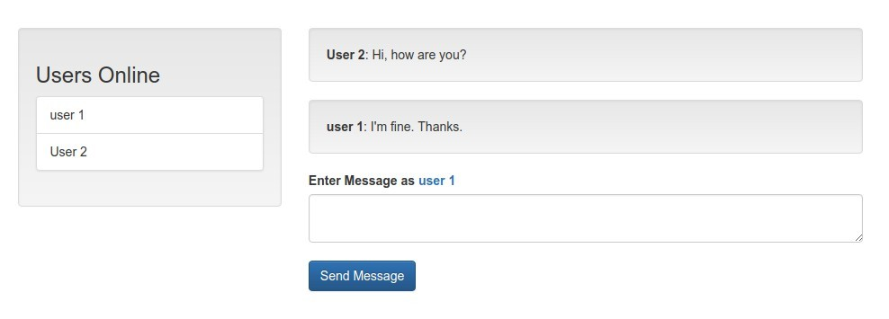
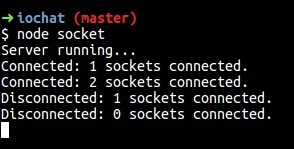

# IO Chat

Simple socket.io example for chat application, built based on [Socket.io Chat App Using Websockets](https://www.youtube.com/watch?v=tHbCkikFfDE&t=2068) tutorial.

## Server Requirements

- Latest [NodeJS](https://nodejs.org/en) LTS installed
- [Yarn](https://yarnpkg.com/en/docs/install) (optional for nodejs [npm](https://www.npmjs.com/get-npm))

## How to install

1. Clone the repo

```bash
$ git clone https://github.com/nafiesl/iochat.git
```

2. Install package dependencies

```bash
$ yarn
// or
$ npm install
```

3. Run the server

```bash
$ node socket
```

4. Open app in browser: http://localhost:3000

## Screenshots

##### Login


##### Chat


##### Terminal

